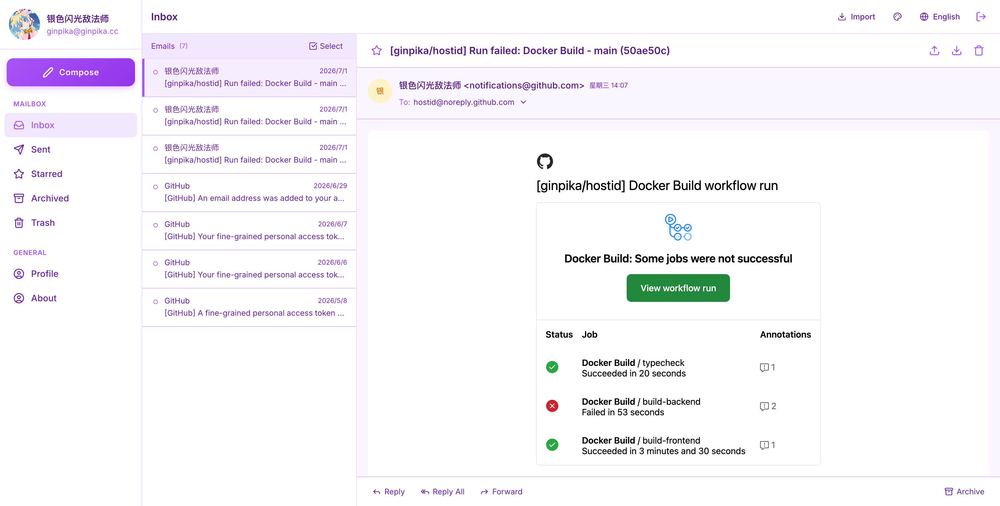
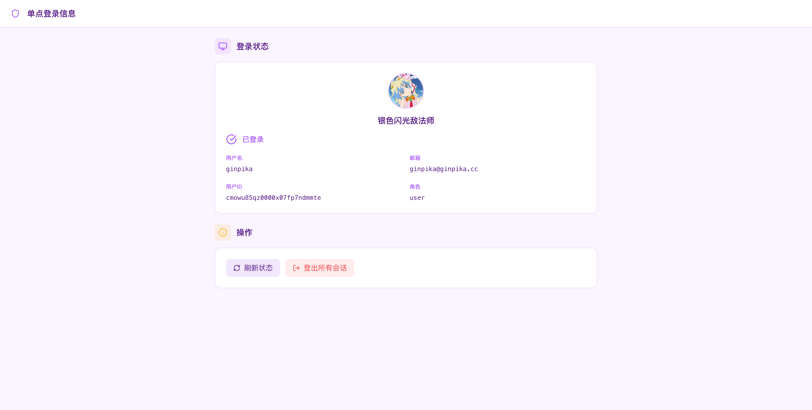
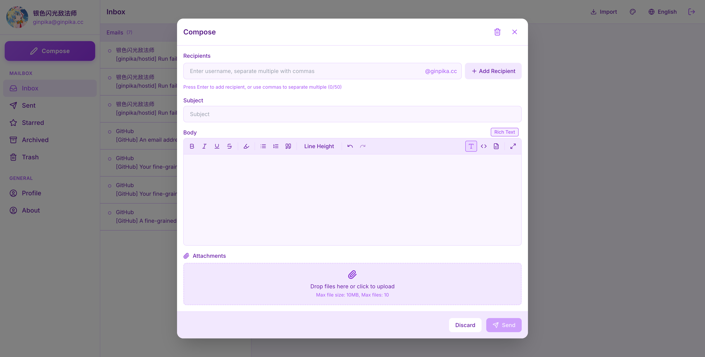

<details>
  <summary>Other previews</summary>
  
  
</details>

[中文](./README.md)

A lightweight self-hosted email application with a minimalist identity authentication service, built on nodemailer + express.js.

## Why I Built HostID

1. I wanted a self-hosted email server with better UI/UX. While there are free email services available, they tend to be either slow or full of ads.
2. I needed a simple SSO or OAuth2 authentication service to manage the various web services I've built.

HostID is the implementation of both of these needs.

## Deployment

```shell
mkdir ./hostid
cd hostid
wget https://raw.githubusercontent.com/ginpika/hostid/refs/heads/main/docs/docker-compose.yaml
touch frontend.env
wget -O backend.env https://raw.githubusercontent.com/ginpika/hostid/refs/heads/main/backend/.env.example
# After properly configuring backend.env & frontend.env, run:
docker-compose up -d
```

The admin account `root` will be automatically initialized, and the password will be written to the logs. You can view it via `docker-compose logs` or check `logs/admin-credentials.log`.

You can also run `reset-admin.cjs` inside the container to reset the root account password.

## .env

See ./backend/.env.example & ./frontend/.env.example for details.

## Development

### Prerequisites
- Node.js 20+
- Docker

#### Backend Setup

```bash
cd backend

# Install dependencies
npm install

# Generate Prisma client
npm run db:generate

# Run database migrations
npm run db:migrate

# Start the dev server
npm run dev
```

#### Frontend Setup

```bash
cd frontend

# Install dependencies
npm install

# Start the dev server
npm run dev
```

## SSO Integration

HostID can serve as an SSO provider for other applications. See the integration guides:

- [Node.js Integration](docs/sso-integration-nodejs.md)
- [Go Integration](docs/sso-integration-go.md)
- [Java Integration](docs/sso-integration-java.md)
- [Rust Integration](docs/sso-integration-rust.md)

### Quick SSO Integration

1. **Check session** from the client application:
   ```javascript
   const res = await fetch('https://mail.yourdomain.com/api/sso/session', {
     credentials: 'include'
   })
   const { authenticated, user } = await res.json()
   ```

2. **Redirect to login page** if not authenticated:
   ```javascript
   window.location.href = `https://mail.yourdomain.com/sso/login?redirect=${encodeURIComponent(currentUrl)}`
   ```

## DNS Configuration

To ensure the mail server works properly, configure the following DNS records:

```
# MX Record
yourdomain.com.    IN    MX    10    mail.yourdomain.com.

# A Record (pointing to server IP)
mail.yourdomain.com.    IN    A    your.server.ip

# SPF Record
yourdomain.com.    IN    TXT    "v=spf1 mx -all"

# DKIM Record (if configured)
default._domainkey.yourdomain.com.    IN    TXT    "v=DKIM1; k=rsa; p=your-public-key"

# DMARC Record
_dmarc.yourdomain.com.    IN    TXT    "v=DMARC1; p=quarantine; rua=mailto:postmaster@yourdomain.com"
```
